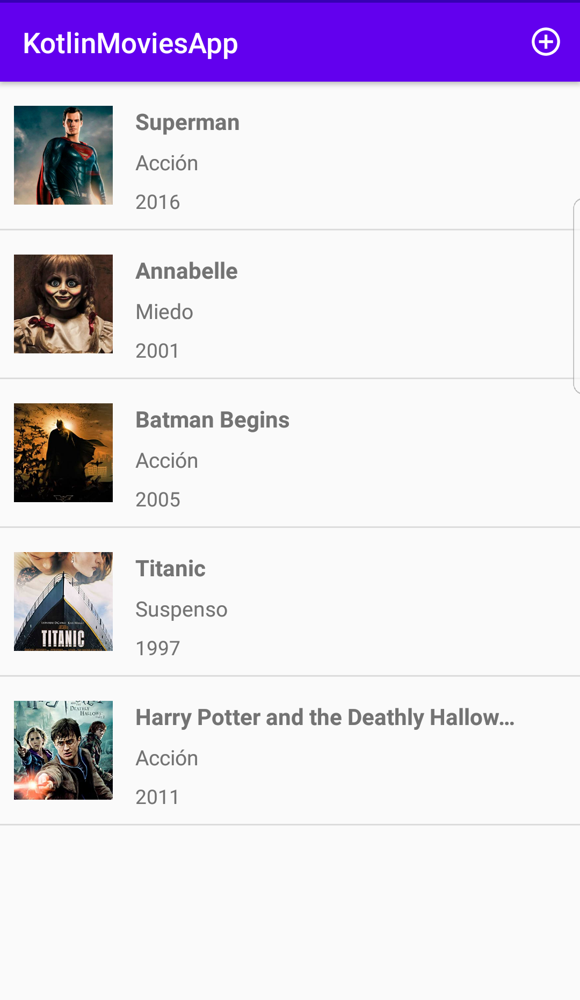
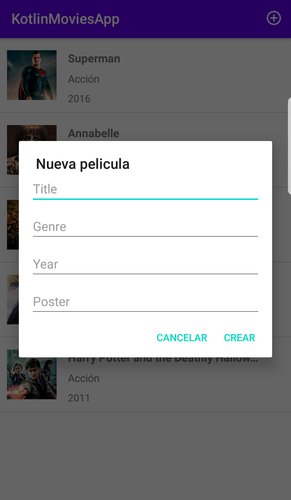

### Movies App with Kotlin
is a simple application that get movies and we can add new movies

# Used Technologies
- Kotlin
- ViewModel
- LiveData
- Glide

# Links and Resources used in this project
- [ViewModel](https://developer.android.com/topic/libraries/architecture/viewmodel?gclid=CjwKCAjw1K75BRAEEiwAd41h1LoTioM8nkc1UQX5ISNi_TtEZKNjRkxhx1KfzAlBQvkLX56qvyvOXBoCdQMQAvD_BwE&gclsrc=aw.ds)
- [LiveData](https://developer.android.com/topic/libraries/architecture/livedata)
- [Android Studio Documentation](https://developer.android.com/docs/)